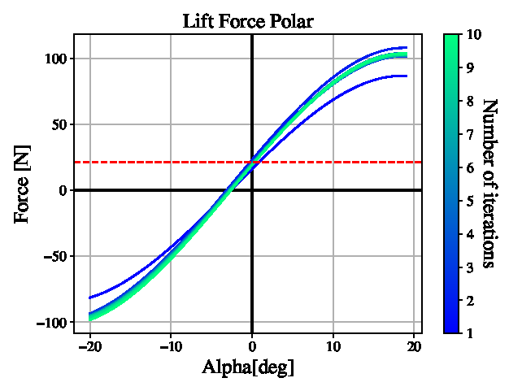
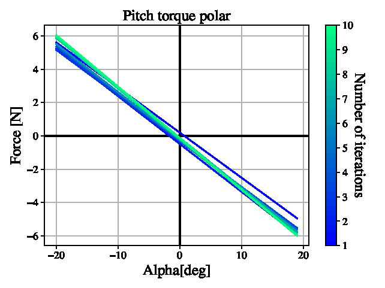
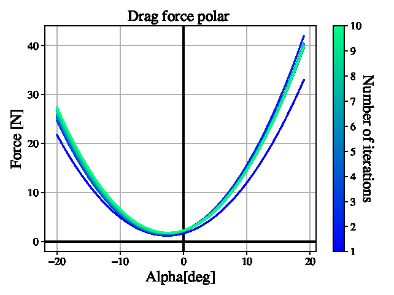
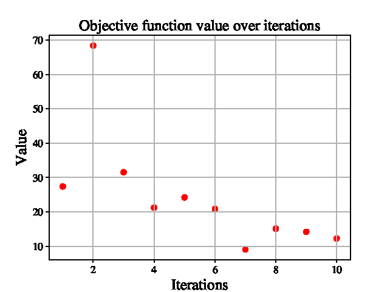
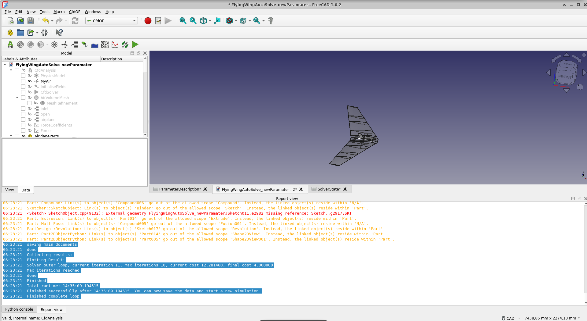

# FlyingWingAutoSolve

Gradient-descent optimizer for a fully parametric flying-wing UAV, built on **FreeCAD** (parametric CAD), **CfdOF + OpenFOAM** (RANS k-ω SST CFD), and **ParaView** (force/moment post-processing). This is the code behind the paper *"Machine-Optimized Parametric Computer Assisted Design (CAD) of a Stable Flying Wing UAV Glider"* (Aerospace Systems, Springer Nature).

The optimizer drives 13 design variables (7 geometric, 5 SPARSEC airfoil, 1 velocity), evaluates each candidate with a CFD run, computes a weighted stability/trim/lift/endurance cost, and steps the design downhill via forward finite differences until convergence (~8–10 iterations).

> There is **no build step and no test suite.** The optimizer runs as a set of FreeCAD *macros* against a `.FCStd` document; a few standalone Python scripts post-process the results.

---

## 1. Requirements

| Component | Version used | Purpose |
|---|---|---|
| **FreeCAD** | **1.0.x** (conda, py311) | Parametric CAD host + macro runner |
| **CfdOF** workbench | **1.29.4** — git `ae13615` (Dec 2024) | Bridges FreeCAD ↔ OpenFOAM (meshing + case writing) |
| **Curved Shapes** workbench | **1.00.13** — git `bf49ebf` (Nov 2024) | Lofts the 3D wing from the airfoil sections |
| **OpenFOAM** | OpenCFD **v2412** | RANS solver (`simpleFoam`, k-ω SST) |
| **ParaView** (`pvbatch`) | 5.11.2 + `python3-paraview` | Extracts forces/moments to CSV; must load `CSVonly.pvsm` |
| **Python 3** + numpy, scipy, pandas, matplotlib | any recent | Standalone result-evaluation scripts only |

> **Pin FreeCAD to 1.0.x and the two geometry addons to the commits above** — see §2.2. FreeCAD **1.1** tightened link-scope enforcement and changed the Curved Shapes / boolean behavior, which breaks the wing-body `Part::MultiFuse` (empty or multi-solid results) even though the geometry itself is sound. The older **CfdOF 1.29.4** also drops the strict build-number check that 1.37.3 applies (1.37.3 rejects 1.0.0 RC builds with *"must be at least 1.0.0 (29177)"*), so with the pinned CfdOF any **1.0.x AppImage — including an RC — works**. The document was later re-saved by a 1.1 dev build; opening it in 1.0.x is a mild downgrade but is the robust combination for regenerating geometry across the parameter space.

On Linux, OpenFOAM and ParaView are installed **natively via apt** (§2.3); **cfMesh is installed through CfdOF's own dependency installer** (the "Install cfMesh" button), because CfdOF needs its *patched* build — the generated `Allmesh` script calls it, not the `cartesianMesh` bundled with OpenFOAM.

---

## 2. Installation

### 2.1 FreeCAD

Download a **1.0.x** conda py311 AppImage from the [FreeCAD releases](https://github.com/FreeCAD/FreeCAD/releases) (a 1.0.0 RC is fine once the addons are pinned per §2.2). Avoid **1.1** — its stricter link-scope enforcement breaks the wing-body boolean fusion (see §1 and §7). We used 1.0.0 RC4.

```bash
chmod +x FreeCAD_<version>-conda-Linux-x86_64-py311.AppImage
./FreeCAD_<version>-conda-Linux-x86_64-py311.AppImage
```

### 2.2 FreeCAD workbenches (addons) — install, then pin

In FreeCAD: **Tools → Addon Manager**, then install and restart:

- **CfdOF** — the CFD pipeline (mesh + case writing + solver control).
- **Curved Shapes** — lofts the 3D wing from the airfoil sections; the document's `CurvedArray`/`CurvedSegment` objects need it.

**Then pin both to the validated commits (important).** The Addon Manager installs the latest versions; newer Curved Shapes + FreeCAD 1.1 produce a *degenerate wing-body fusion* (the central `Part::MultiFuse` comes out empty or as multiple un-welded solids for many design vectors). The commits below are the last known-robust versions and match the environment the model was authored/validated in. Both addons are plain git checkouts under FreeCAD's Mod directory, so pin them with `git checkout`:

```bash
# FreeCAD 1.0.x uses ~/.local/share/FreeCAD/Mod  (1.1 uses a separate v1-1/Mod)
MOD="$HOME/.local/share/FreeCAD/Mod"

# Curved Shapes 1.00.13  (chbergmann/CurvedShapesWorkbench)
git -C "$MOD/CurvedShapes" checkout bf49ebf

# CfdOF 1.29.4  (jaheyns/CfdOF)  -- also drops the strict FreeCAD-build check,
# so it accepts a 1.0.0 RC AppImage
git -C "$MOD/CfdOF" checkout ae13615
```

Verify, and restart FreeCAD:

```bash
git -C "$MOD/CurvedShapes" describe --tags --always   # -> bf49ebf
git -C "$MOD/CfdOF"        describe --tags --always   # -> v0-806-gae13615
```

> To return to the latest versions later: `git -C "$MOD/<addon>" checkout master`.


### 2.3 CFD dependencies (native, Linux)

Unlike Windows, install the CFD stack from your package manager, then point CfdOF at it:

```bash
# OpenFOAM (OpenCFD v2412 — bundles cfMesh's cartesianMesh); -dev provides wmake
sudo apt install openfoam2412-default openfoam2412-dev
# ParaView + its Python bindings (pvbatch/pvpython + paraview.simple — the pipeline needs these)
sudo apt install paraview python3-paraview
```

Then in FreeCAD, **Edit → Preferences → CfdOF → Dependencies**:

1. CfdOF **auto-detects** the OpenFOAM install (`/usr/lib/openfoam/openfoam2412`) and ParaView (`/usr/bin/paraview`) once the apt packages are present — you normally don't need to set either path manually. Only fill them in if the checker reports them blank or wrong.
2. Click **Install cfMesh** — this downloads CfdOF's patched cfMesh (`cfmesh-cfdof`) and compiles it against your OpenFOAM (needs `openfoam2412-dev` for `wmake`, installed above). On FreeCAD 1.1 the download is reasonably quick. Keep the panel open until it finishes.
3. Click **Check dependencies**.

**Expected (working) checker output** — this remaining "not found" line is normal and harmless:

- `HiSA not found` — HiSA is a compressible solver; this is an incompressible case (`simpleFoam`). Not used.

Everything else (FreeCAD version, OpenFOAM, **cfMesh**, ParaView, gmsh ≥ 4.15) should pass.


### 2.4 Python for the evaluation scripts

The macros use FreeCAD's bundled Python, but the standalone eval scripts use a system/venv Python:

```bash
python -m venv .venv && source .venv/bin/activate
pip install numpy scipy pandas matplotlib
```

### 2.5 Make this repo importable inside FreeCAD (required)

The model document contains scripted objects whose Proxy classes live in this repo's own `fpo/` package (the `airfoil` / SPARSEC `parsec` airfoil generators). The macros also `import WingSolver_dependencies...`. FreeCAD must have the **repo root on its Python `sys.path`**, or opening the document fails with `ModuleNotFoundError: No module named 'fpo'` (and the airfoil objects load broken).

The robust fix is a one-line startup module — FreeCAD runs `Init.py` from every `Mod/` subfolder at startup, *before* any document opens:

```bash
mkdir -p ~/.local/share/FreeCAD/Mod/FlyingWingPath
cat > ~/.local/share/FreeCAD/Mod/FlyingWingPath/Init.py <<'EOF'
import sys
_repo = "/ABSOLUTE/PATH/TO/FlyingWingAutoSolve"   # <-- edit to your checkout
if _repo not in sys.path:
    sys.path.append(_repo)
EOF
```

Then **restart FreeCAD** and open the document. Verify in the Python console:

```python
import fpo                      # no error = path is set up
```

_Alternatives:_ launch the AppImage with `PYTHONPATH=/path/to/FlyingWingAutoSolve ./FreeCAD...AppImage`, or, for a one-off, `sys.path.append(...)` in the Python console **before** opening the document. Note: the path must be set *before* the document loads — appending it after the file is already open (with broken objects) does not retroactively repair them; close and reopen.

---

## 3. Configuration (per machine)

Almost all state lives in **FreeCAD spreadsheet objects** inside the `.FCStd`, looked up by label. Before running, open `FlyingWingAutoSolve_newParamater.FCStd` and set the two machine-specific cells in the **`ParameterDescription`** spreadsheet:

**`BaseDir`** → absolute path to this repository checkout. It drives where `workingdir/` and `results/` are created and where the macros look for `U` / `pvScript.py`.

```
BaseDir = /home/<you>/path/to/FlyingWingAutoSolve
```

**`pvBatchPath`** → absolute path to the **`pvbatch`** executable (ParaView's headless batch-Python runner). The optimizer calls `<pvBatchPath> pvScript.py` in each case directory; `pvScript.py` loads `CSVonly.pvsm` and exports the forces/moments to `mycsv.csv`, which the cost analysis then reads. If this is wrong, no `mycsv.csv` is produced and every case fails at the analysis step.

```
pvBatchPath = /usr/bin/pvbatch        # apt ParaView 5.11 + python3-paraview
```

Notes:
- Use **`pvbatch`**, not `paraview` (GUI) or `pvpython` — it's the headless runner suited to an automated loop.
- This is **separate** from CfdOF's own ParaView preference (`/usr/bin/paraview`); the `pvBatchPath` cell is read directly by the macros.
- Find it with `command -v pvbatch`; confirm its Python works with `pvbatch -c 'from paraview.simple import *'` (needs `python3-paraview`).


> **The document ships with the original author's paths** (`/home/sgrimm/...`, `/opt/paraviewopenfoam510/...`). You **must** overwrite `BaseDir` and `pvBatchPath` and **save the document**, or the first run fails with `PermissionError: '/home/sgrimm'`

### 3.1 Tuning the optimization

Two more spreadsheets control *what* is optimized and *when it stops*. These are not machine-specific — edit them to change the study, not to install.

**`ParameterDescription`** — the design-variable setup. Each row is one of the 13 variables, with columns:

| Column | Meaning |
|---|---|
| `DefaultValues` | Initial value of each variable (the starting design vector `d₀`; `ResetDefaults` restores these). |
| `MinValue` / `MaxValue` | Hard bounds — each optimizer step is clamped into `[min, max]`; an out-of-range/NaN value falls back to the default. |
| `SensibleStepWidth` | Per-variable scale used both for the finite-difference perturbation and to scale the gradient-descent step, so variables with very different units move sensibly. |
| `MeshSizes` | List of cartesian cell sizes (mm) tried **finest → coarsest**; meshing auto-falls-back to the next coarser one if it fails, and fixes that size for the rest of the iteration. |

**`SolverControl`** — termination and step size:

| Cell | Meaning |
|---|---|
| `MaxIterations` | Stop after this many outer iterations. |
| `FinalCost` | Stop once the objective `f(d)` drops below this (the "minimum objective" criterion). |
| `InitialLearningRate` | Starting learning rate `κ`. |
| `LearningRateAlpha` | Decay factor: `LR = InitialLearningRate · LearningRateAlpha^(iter−1)` (per-iteration reset in `CalcGradient`, decayed in `OuterLoop`). |

> ! Objects are referenced **by label**, not internal name — renaming an object in the model tree will break the macros.

### 3.2 Parallel cores (match your machine)

**The document is configured for a 40-core machine.** On a smaller machine you *must* lower the core count, or OpenFOAM tries to launch more MPI ranks than you have cores and the solves fail. Adjust it in **two** places:

1. **FreeCAD — `CfdSolver` "Parallel Cores".** In the model tree expand **`CfdAnalysis` → `CfdSolver`** and set the **`Parallel Cores`** property to **at most your physical CPU core count** (e.g. the output of `nproc`). It ships at **40**. This controls how many ranks each OpenFOAM solve uses (`decomposePar`).

2. **OpenMPI host slots — `/etc/openmpi/openmpi-default-hostfile`.** OpenMPI caps ranks per host via this file. Set the local slot count to your core count:

   ```
   localhost slots=24
   ```

   With `slots=24`, OpenFOAM will not use more than 24 ranks on this machine regardless of other settings (adjust `24` to your core count).

> The optimizer also launches **all** mesh/solve jobs for an iteration **at once** (`xargs -P0`, see §4), so the real load is roughly *(number of concurrent cases) × (Parallel Cores)*. Keep `Parallel Cores` modest so the simultaneous cases don't oversubscribe the CPU.

---

## 4. Running a simulation

1. Open `FlyingWingAutoSolve_newParamater.FCStd` in FreeCAD.
2. Make sure the repo is on FreeCAD's `sys.path` (see §2.5) so `WingSolver_dependencies` and `fpo` import.
3. Confirm §3 config is set and saved (`BaseDir`, `pvBatchPath`, tuning in §3.1).
4. **Reset the `SolverState` spreadsheet** (see below) — required before every fresh run.
5. **Execute `WingSolver_CompleteLoop.FCMacro`** — the entry point that runs the whole optimization:

   ```
   <repo>/WingSolver_CompleteLoop.FCMacro
   ```

   Run it from the **Macro dialog**: *Macro → Macros…*, set the user-macro location to the repo folder, select `WingSolver_CompleteLoop.FCMacro`, and click **Execute**. (Running from the Macro dialog sets `__file__`, which the macro needs to locate its sibling macros and `WingSolver_dependencies`.)

### Resetting `SolverState` before a run

`SolverState` accumulates **one row per iteration** (`CalcGradient` inserts a new row at the top each time), and `OuterLoop` derives the current iteration number from the sheet's used range. Leftover rows from a previous run therefore corrupt the iteration count and the stopping logic. Before starting a fresh optimization:

- **Delete all data rows** so the sheet is empty of results, and
- **make sure the column labels are back in the first row.**

Start the run only once `SolverState` holds just its header/label row.

### What the run does

`WingSolver_CompleteLoop` runs the whole optimization. Under the hood:

```
WingSolver_CompleteLoop
├── WingSolver_ResetDefaults      # params → defaults, reset learning rate, regen U from U_template
├── WingSolver_CalcGradient       # base + one perturbed CFD run per parameter (forward finite diff)
│     ├── writes cfMesh + OpenFOAM case per config
│     ├── runs all ./Allmesh, then ./Allrun, in parallel (xargs -P0)
│     ├── runs pvScript.py under pvbatch → mycsv.csv (forces/moments)
│     ├── WingSolver_AnalyseResult   # fit polars, static margin, 4-term cost
│     └── WingSolver_OptimizeVelocity# L-BFGS-B over velocity, rewrite U field
└── WingSolver_OuterLoop          # gradient-descent loop until MaxIterations / FinalCost
      └── WingSolver_PrepareNextStep # normalize gradient, step, clamp to bounds
```

Each iteration's per-config CSVs (`rawresult.csv`, `result.csv`, `parameters.csv`, `geometry.csv`, `mass.csv`) are copied into `results/<iteration>/`. The per-iteration solver state is written to `results/sstate.csv`. Progress prints to the FreeCAD Report view.

**Meshing/solver robustness:** if the parallel mesher fails it automatically retries with successively coarser sizes from the `MeshSizes` cell; solvers retry up to 5× (re-meshing between attempts). First-attempt failures in the log are therefore not necessarily fatal.

### What a successful run looks like

The images below show the output of a healthy, converged run — the aerodynamic polars, the objective-function history, and the FreeCAD terminal output. The plots are generated by the `WingSolver_EvaluateResults.py` script.



*1. Lift force vs. angle of attack (cubic fit) for the optimized design.*


*2. Pitching moment vs. angle of attack, showing the trim point and static margin.*


*3. Drag force vs. angle of attack (quadratic fit).*


*4. The objective function `f(d)` decreasing over the optimization iterations.*


*5. FreeCAD Report view / terminal output of a successful run.*

---

## 5. Evaluating results

The standalone scripts turn a `results/` directory into plots and summary numbers. **Edit the hard-coded `run_dir` path at the top of each before running:**

- `WingSolver_EvaluateResults.py` — polars, cost components, and per-parameter histories → `evaluation/*.eps`.
- `getPerformance.py` — prints static margin, power, trim, lift deficit, total cost for one iteration.
- `Tools/checkgradient.py`, `Tools/checkpolar.py`, `Tools/plotEachIteration.py` — diagnostics.
- `Tools/analyse_meshes.py` — runs OpenFOAM `checkMesh` over every saved mesh case and collects mesh-quality characteristics into one CSV (the mesh-independence study behind the paper's mesh table).
- `Tools/extract_residuals.py` — extracts the averaged final CFD residual per angle-of-attack/sideslip sweep segment (the case is a fixed-step sweep, not a converging solve, so this reports each segment's residual floor rather than a convergence history).
- `Tools/find_broken_geometry.py` — diagnoses broken sketch geometry (zero-length edges, error-state objects) in the currently open document; run inside the FreeCAD Python console.
- `Tools/verify_random_configs.py` — samples random design vectors, rebuilds the CAD for each, and reports which configs fail to regenerate cleanly (checks the sketch/boolean fixes in §7 hold across the whole design space).
- `Tools/mesh_stats.py` — summarizes `Tools/analyse_meshes.py`'s output CSV (mean/std/min/max per mesh-quality metric) into the aggregate numbers for the paper's mesh table.
- `Tools/residual_stats.py` — summarizes `Tools/extract_residuals.py`'s output, grouping the residual floors by config/phase/angle.
- `Tools/extract_repeat_polars.py` — extracts the raw AoA-sweep polars plus fitted `dM/dα`, trim moment `M0`, and total cost from a pair of repeat CFD runs of the same starting design.
- `Tools/compare_noise_to_fd_step.py` — compares the run-to-run CFD noise floor (from the repeat runs extracted above) against the finite-difference objective-change per step, backing the "CFD noise is below the FD signal" claim in §3.2 of the paper.

Run with the venv from §2.4:

```bash
python WingSolver_EvaluateResults.py
```

---

## 6. Repository layout

- `WingSolver_*.FCMacro` — the optimizer macros (entry point: `WingSolver_CompleteLoop`).
- `WingSolver_dependencies/` — helper package: `costfunction.py` (4 penalty terms), `WingSolver_Dependencies.py` (CSV/data + velocity-file helpers), `Macro_Dependencies.py`.
- `fpo/airfoil/` — FreeCAD `FeaturePython` airfoil objects: Bernstein-polynomial (`airfoil`) and SPARSEC (`parsec`) parametrizations.
- `FlyingWingAutoSolve_newParamater.FCStd` — the parametric model the optimizer runs against.
- `FlyingWingAutoSolve_newParamater_optimized.FCStd` — the same model with the optimizer's final design vector already filled in, so the optimized geometry/CFD case can be inspected without rerunning the full optimization.
- `pvScript.py` + `CSVonly.pvsm` — ParaView batch script + saved state that extract forces to `mycsv.csv`.
- `U`, `U_template`, `inlet.dat` — OpenFOAM velocity boundary condition (regenerated from the template as velocity changes).
- `write_table.py` — generates the fixed-step AoA/beta sweep table used for `inlet.dat`/`U`. `write_table_airspeed.py`, `write_table_quick.py`, `write_table_quick_2axis.py`, `write_table_steady.py` are earlier iterations on the sweep schedule, kept for reference but not the ones used for the paper's runs.
- `old_scripts/` — superseded one-off scripts kept for reference, not part of the active pipeline.
- `Tools/` — standalone diagnostics and post-processing scripts, see §5.
- `workingdir/`, `results/` — generated at runtime (git-ignored).

---

## 7. Known reproducibility caveats

- **The wing-body fusion is boolean-fragile — pin the geometry toolchain (§2.2).** On FreeCAD **1.1** (stricter link-scope enforcement) and/or newer **Curved Shapes**, the central `Part::MultiFuse` that welds the body can return an *empty* shape or *multiple un-welded solids* for many design vectors — even though the individual parts are valid — because components meet with near-coincident/tangent faces. Symptoms in the Report view: `Bnd_Box is void`, `... go out of the allowed scope ... reside within 'N/A'`, and a fused body with >1 solid. Use the pinned FreeCAD 1.0.x + addon commits. `Tools/verify_random_configs.py` samples the parameter space and flags configs whose geometry fails to rebuild; `Tools/find_broken_geometry.py` locates the offending sketch/edge.
- **ParaView `.pvsm` coupling is version-sensitive.** `pvScript.py` loads `CSVonly.pvsm` by relative path; a ParaView version that can't load the saved state will fail to produce `mycsv.csv`. Pin the ParaView version.
- **Hard-coded paths** remain in the evaluation scripts (result directories) — edit for your machine before running them.
- Macro header comments still reference the original author's paths; the real paths come from `BaseDir` and `__file__`.
